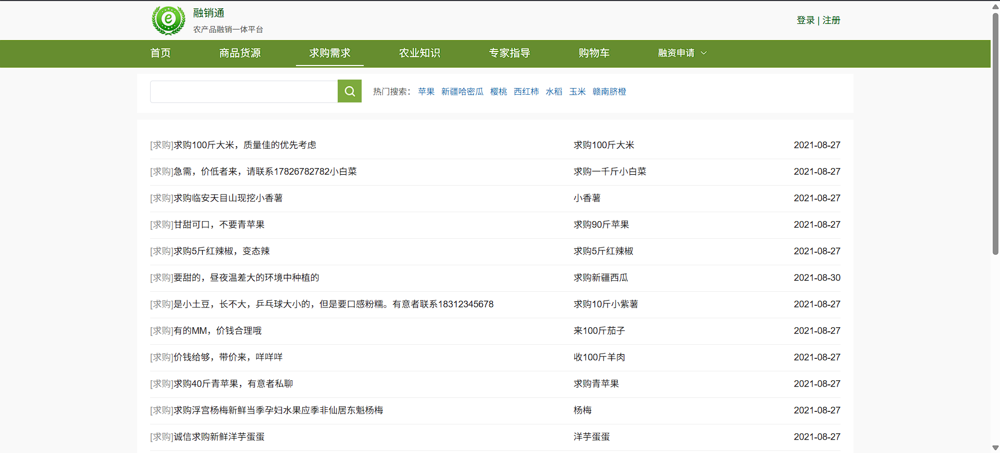

# RongXiaoTong
融消通农产品销售平台

# 运行环境
nodejs版本:node:'v20.15.1'. npm:'10.8.2'
Java  版本:jdk1.8.0_271
Redis 版本:x64-5.0.14.1
Mysql 版本:8

# 运行方法

1. 配置好Myqsl和Redis环境

2. vue1文件是前端、rongxiaotongNew文件是后端，分别运行相应文件。
前端：
npm install 
npm run server

后端：
运行RongXiaoTongApplication文件

# 项目效果展示

首页

商品货源

求购需求

农业知识
